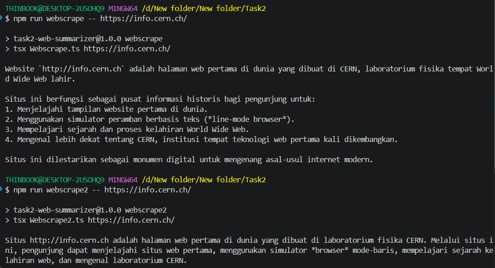

# MagangHub 2026 — Technical Assessment

Repository ini berisi pengerjaan tiga task technical assessment. Penjelasan jawaban disimpan di dalam folder masing-masing, sedangkan petunjuk implementasi dan cara menjalankan project tersedia di README utama ini.

---

## Task 1 — Customer Email Handling Flow

Task 1 menjelaskan alur penanganan email customer menggunakan LLM Analysis, pemeriksaan critical issue, riwayat masalah, klasifikasi, RAG, human escalation, dan guardrail.

- [Baca penjelasan Task 1](./Task1/penjelasan%20Task%201.md)
- [Lihat diagram Task 1](./Task1/Task1.png)

---

## Task 2 — Website Scraping and Summarization

Task 2 menunjukkan perbandingan antara script scraping sederhana dan versi yang diperbaiki untuk menangani halaman kompleks serta konten panjang.

### Hypothetical implementation

```text
Task2/
├── Webscrape.ts              # Script awal untuk halaman sederhana
├── Webscrape2.ts             # Script dengan perbaikan lengkap
├── callLLM.ts                # Integrasi LLM untuk kedua script
├── Task2.png                 # Hasil pengujian kedua script
├── package.json
├── package-lock.json
└── tsconfig.json
```

- [Baca penjelasan Task 2](./Task2/penjelasan%20Task%202.md)
- [`Webscrape.ts`](./Task2/Webscrape.ts) merupakan versi awal. Script menghapus tag HTML menggunakan regex dan mengirim seluruh teks ke LLM sekaligus. Pendekatan ini masih dapat digunakan untuk halaman sederhana.
- [`Webscrape2.ts`](./Task2/Webscrape2.ts) merupakan versi perbaikan. Script menggunakan Cheerio untuk memilih konten utama, membagi teks panjang menjadi chunk, meringkas setiap chunk, dan menerapkan guardrail maksimal 150 kata.

### Hasil pengujian

Kedua script diuji menggunakan `https://info.cern.ch/`. `Webscrape.ts` berhasil membuat ringkasan, tetapi hasilnya lebih panjang dan sebagian informasi ditampilkan sebagai daftar. `Webscrape2.ts` memberikan hasil yang lebih singkat dan fokus setelah konten melewati proses pembersihan, chunking, serta guardrail.



### LLM yang digunakan

Implementasi menggunakan **Gemini API** dengan model default `gemini-3.5-flash-lite`. Model ini dipilih karena sesuai untuk percobaan singkat seperti summarization dan tersedia dalam free tier dengan batas pemakaian tertentu. Detail biaya dan ketersediaan free tier dapat dilihat pada [Gemini API Pricing](https://ai.google.dev/gemini-api/docs/pricing).

File [`callLLM.ts`](./Task2/callLLM.ts) mengirim prompt melalui REST endpoint `generateContent` dan mengambil teks hasil dari `candidates[0].content.parts`. Struktur request mengikuti [dokumentasi resmi Gemini text generation](https://ai.google.dev/gemini-api/docs/text-generation).

### Cara menjalankan Task 2

Pastikan Node.js sudah terpasang. Buat API key melalui [Google AI Studio](https://aistudio.google.com/apikey), lalu salin konfigurasi contoh:

```bash
cd Task2
copy .env.example .env
```

Isi `GEMINI_API_KEY` di dalam `.env`, kemudian jalankan:

```bash
npm install

# Versi sederhana
npm run webscrape -- https://example.com

# Versi setelah perbaikan
npm run webscrape2 -- https://example.com
```

Model dapat diubah melalui `GEMINI_MODEL` di file `.env`. File `.env` dan folder `node_modules` tidak akan masuk ke Git sehingga API key tidak ikut ter-commit.

---

## Task 3

Task 3 berisi agent sederhana berbasis Gemini API yang menjawab pertanyaan dari sample document lowongan Frontend Developer, mengingat nama dan konteks percakapan selama sesi, serta dapat memilih untuk memanggil calculator tool ketika diperlukan.

```text
Task3/
├── Agent.ts                  # Agent, memory, dan calculator tool
├── sample-document.md        # Sumber informasi agent
├── penjelasan Task 3.md      # Penjelasan implementasi
├── package.json
└── tsconfig.json
```

- [Baca penjelasan Task 3](./Task3/penjelasan%20Task%203.md)
- [Lihat sample document](./Task3/sample-document.md)
- [Lihat implementasi agent](./Task3/Agent.ts)

### Cara menjalankan Task 3

```bash
cd Task3
npm install
copy .env.example .env
npm start
```

Isi `GEMINI_API_KEY` pada file `.env` sebelum menjalankan agent. Dalam mode interaktif, ketik `keluar` untuk menghentikan program.

Agent juga dapat diuji langsung dengan beberapa pertanyaan dalam satu sesi:

```bash
npm start -- "Nama saya Andi" "Siapa nama saya?" "Berapa total gaji selama masa percobaan?"
```
