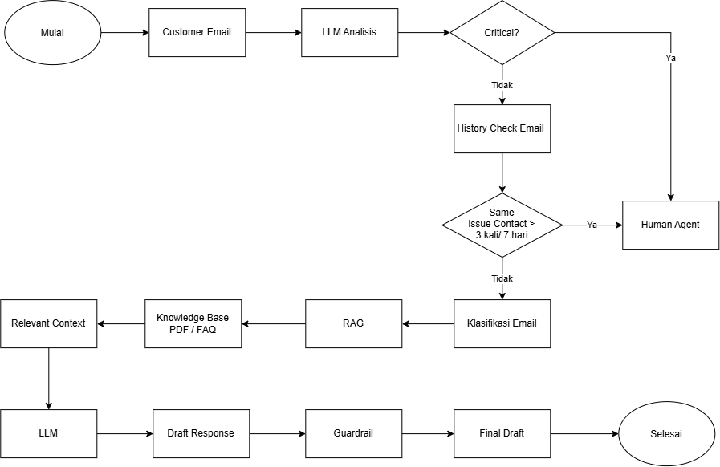

# ✦ Penjelasan Task 1

> Alur penanganan email customer dengan LLM, RAG, dan guardrail.

---

## 01 — Analisis email & isu kritis

Pertama alurnya dimulai dari **email customer yang masuk ke sistem**. Setelah itu email akan masuk ke **LLM Analysis**. Di bagian ini LLM membaca isi email untuk mengetahui sebenarnya customer sedang membahas masalah apa.

Setelah itu saya taruh pengecekan **critical issue** terlebih dahulu. Contohnya seperti **data loss, service outage, atau security breach**. Menurut saya bagian ini perlu dicek lebih awal, karena kalau masalahnya memang cukup serius, tidak perlu menunggu customer menghubungi berkali-kali dulu. Walaupun baru satu kali mengirim email, kasus seperti ini lebih baik langsung diarahkan ke **human agent**.

---

## 02 — Pengecekan riwayat email

Kalau ternyata bukan masalah critical, baru sistem melakukan **history check email**. Di sini sistem melihat apakah customer sebelumnya pernah menghubungi untuk masalah yang sama.

Awalnya saya terpikir cukup pakai aturan **tiga kali menghubungi dalam satu minggu**, tapi setelah dipikirkan lagi ternyata kurang tepat. Bisa saja customer kirim tiga email dalam seminggu tetapi topiknya berbeda-beda. Kalau langsung dilempar ke human agent hanya karena jumlah emailnya, menurut saya jadi kurang efektif.

Karena itu saya ubah logikanya menjadi **tiga kali menghubungi dalam satu minggu dengan masalah yang sama**. Jadi sistem tidak cuma menghitung berapa kali customer kirim email, tetapi melihat apakah memang masalahnya masih sama dan belum selesai.

Kalau ternyata sudah tiga kali membahas masalah yang sama dalam satu minggu, baru saya arahkan ke **human agent**. Alasannya karena kemungkinan jawaban sebelumnya belum menyelesaikan masalah customer, jadi lebih baik ditangani langsung oleh manusia.

---

## 03 — Klasifikasi & RAG

Kalau tidak, proses lanjut ke **klasifikasi email**. Di sini email dikelompokkan berdasarkan jenis masalahnya, misalnya **billing, technical issue, feedback**, atau kategori lainnya.

Setelah itu masuk ke **RAG**. Secara sederhana, RAG saya gunakan untuk mencari informasi yang sesuai dari **knowledge base**, misalnya dari FAQ, PDF, dokumentasi, atau informasi resmi perusahaan. Jadi LLM tidak langsung membuat jawaban sendiri, tetapi punya sumber informasi yang bisa dijadikan dasar.

Dari proses RAG itu, sistem akan mengambil **relevant context**, yaitu informasi yang paling sesuai dengan masalah customer. Context tersebut kemudian diberikan ke LLM berikutnya untuk membuat **draft response**.

---

## 04 — Respons & validasi

Jadi dua LLM di alur ini fungsinya berbeda. LLM yang pertama untuk **membaca dan memahami masalah email**, sedangkan LLM yang kedua untuk **membuat jawaban berdasarkan context yang didapat dari RAG**.

Setelah draft response dibuat, hasilnya masuk ke **guardrail**. Di bagian ini respons dicek lagi sebelum menjadi jawaban akhir, misalnya untuk memastikan isi jawabannya masih sesuai, tidak keluar dari informasi yang tersedia, dan tidak memberikan informasi yang seharusnya tidak diberikan.

Kalau sudah lolos, baru menjadi **final response** dan proses selesai.

---
